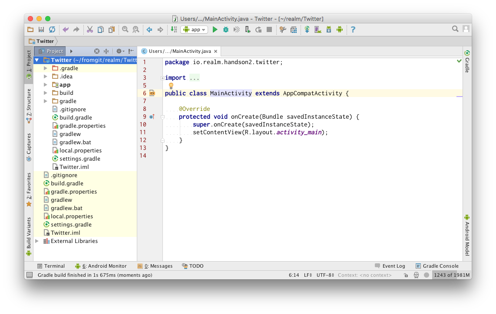

[https://github.com/zaki50/Realm-Hands-On2_android](https://github.com/zaki50/Realm-Hands-On2_android) からコードがダウンロードできます。また、各見出しに対応したcommitがmasterブランチに存在するので、それぞれの部分までの途中経過も確認できます。

# 1.プロジェクトの作成

以下の設定でAndroid Studioから新規にプロジェクトを作成します。

<dl>
  <dt>Application name</dt>
  <dd>Twitter</dd>
  <dt>Company Domain</dt>
  <dd>handson2.realm.io</dd>
  <dt>Minimum SDK</dt>
  <dd>15</dd>
  <dt>Activity type</dt>
  <dd>Empty Activity</dd>
</dl>


プロジェクトを作成したら、左上のProject Viewを`Android`から`Project`へ変更します。こうすることで、実際のディレクトリ構成と一致した状態で表示することができます。




この状態で、一旦 `Tools > Android > Sync Project with Gradle Files` を実行し、エラーなくビルドできることを確認します。

また、この段階でアプリが実行できることを確認してください。

# 2.Realmのセットアップ
Gradleプラグインを適用することで、Realmが使用できるようにします。

`./build.gradle` の `buildscript.dependencies`の中に`classpath 'io.realm:realm-gradle-plugin:0.88.3'`を記述します。この記述により、使用するRealmのバージョンが決定されます。追加後は以下のようになります。

```
// Top-level build file where you can add configuration options common to all sub-projects/modules.

buildscript {
    repositories {
        jcenter()
    }
    dependencies {
        classpath 'com.android.tools.build:gradle:2.0.0'
        classpath 'io.realm:realm-gradle-plugin:0.88.3'

        // NOTE: Do not place your application dependencies here; they belong
        // in the individual module build.gradle files
    }
}

allprojects {
    repositories {
        jcenter()
    }
}

task clean(type: Delete) {
    delete rootProject.buildDir
}
```

次に、`app/build.gradle`の2行目に`apply plugin: 'realm-android'`を記述します。この記述は、`apply plugin: 'com.android.application'`より後に来るようにしてください。

```
apply plugin: 'com.android.application'
apply plugin: 'realm-android'

android {
    compileSdkVersion 23
    buildToolsVersion "24.0.0 rc2"

    defaultConfig {
        applicationId "io.realm.handson2.twitter"
        minSdkVersion 15
        targetSdkVersion 23
        versionCode 1
        versionName "1.0"
    }
    buildTypes {
        release {
            minifyEnabled false
            proguardFiles getDefaultProguardFile('proguard-android.txt'), 'proguard-rules.pro'
        }
    }
}

dependencies {
    compile fileTree(dir: 'libs', include: ['*.jar'])
    testCompile 'junit:junit:4.12'
    compile 'com.android.support:appcompat-v7:23.3.0'
}
```


この状態で、一旦 `Tools > Android > Sync Project with Gradle Files` を実行し、エラーなくビルドできることを確認します。

アプリのとしては変化はありあせんが、これによりRealmを使用する準備が整いました。


# 3.タイムライン表示の作成

ここからしばらくはTwitterの表示部分の実装を進めていきます。

## 3.1 レイアウトファイルの作成

`app/main/res/layout/activity_main.xml`を開き、もとの記述を削除した後ViewPagerとPagerTitleStripを配置します。

```
<?xml version="1.0" encoding="utf-8"?>
<android.support.v4.view.ViewPager
    android:id="@+id/pager"
    xmlns:android="http://schemas.android.com/apk/res/android"
    xmlns:tools="http://schemas.android.com/tools"
    android:layout_width="match_parent"
    android:layout_height="match_parent"
    tools:context="io.realm.handson2.twitter.MainActivity">

    <android.support.v4.view.PagerTitleStrip
        android:id="@+id/pager_title_strip"
        android:layout_width="match_parent"
        android:layout_height="wrap_content"
        android:layout_gravity="top"
        android:paddingBottom="4dp"
        android:paddingTop="4dp"/>

</android.support.v4.view.ViewPager>
```

つぎに、1ツイート分のレイアウトとして`app/main/res/layout/listitem_tweet.xml`を作成します。

```
<?xml version="1.0" encoding="utf-8"?>
<RelativeLayout xmlns:android="http://schemas.android.com/apk/res/android"
                xmlns:tools="http://schemas.android.com/tools"
                android:layout_width="match_parent"
                android:layout_height="wrap_content"
                android:orientation="vertical"
                android:padding="8dp">

    <ImageView
        android:id="@+id/image"
        android:layout_width="48dp"
        android:layout_height="48dp"
        android:layout_alignParentLeft="true"
        android:layout_alignParentStart="true"
        android:layout_alignParentTop="true"
        android:background="#10000000"
        tools:ignore="ContentDescription"/>

    <TextView
        android:id="@+id/screen_name"
        android:layout_width="match_parent"
        android:layout_height="wrap_content"
        android:layout_alignParentEnd="true"
        android:layout_alignParentRight="true"
        android:layout_marginLeft="8dp"
        android:layout_marginStart="8dp"
        android:layout_toEndOf="@id/image"
        android:layout_toRightOf="@id/image"
        android:textAppearance="?android:attr/textAppearanceMedium"
        tools:text="screen name"/>

    <TextView
        android:id="@+id/text"
        android:layout_width="match_parent"
        android:layout_height="wrap_content"
        android:layout_alignLeft="@id/screen_name"
        android:layout_alignParentEnd="true"
        android:layout_alignParentRight="true"
        android:layout_alignStart="@id/screen_name"
        android:layout_below="@id/screen_name"
        android:textAppearance="?android:attr/textAppearanceSmall"
        tools:text="Lorem Ipsum is simply dummy text of the printing and typesetting industry."/>

</RelativeLayout>
```


レイアウトは　以上で準備完了です。以降でJavaのコードを記述していきます。

## 3.2 Javaコード

ViewPagerの中身となるFragmentとして、`app/main/src/java/`に`io.realm.handson2.twitter.TimelineFragment`クラスを以下のように作成します。現状では、

```
package io.realm.handson2.twitter;

import android.os.Bundle;
import android.support.annotation.Nullable;
import android.support.v4.app.ListFragment;
import android.widget.ArrayAdapter;
import android.widget.ListAdapter;

import java.util.Arrays;

public class TimelineFragment extends ListFragment {

    @Override
    public void onCreate(@Nullable Bundle savedInstanceState) {
        super.onCreate(savedInstanceState);

        final ListAdapter adapter = new ArrayAdapter<String>(getContext(),
                R.layout.listitem_tweet,
                R.id.text,
                Arrays.asList("Lorem Ipsum is simply dummy text of the printing and typesetting industry.",
                        "Lorem Ipsum is simply dummy text of the printing and typesetting industry.",
                        "Lorem Ipsum is simply dummy text of the printing and typesetting industry.",
                        "Lorem Ipsum is simply dummy text of the printing and typesetting industry.",
                        "Lorem Ipsum is simply dummy text of the printing and typesetting industry.",
                        "Lorem Ipsum is simply dummy text of the printing and typesetting industry.",
                        "Lorem Ipsum is simply dummy text of the printing and typesetting industry.",
                        "Lorem Ipsum is simply dummy text of the printing and typesetting industry.",
                        "Lorem Ipsum is simply dummy text of the printing and typesetting industry.",
                        "Lorem Ipsum is simply dummy text of the printing and typesetting industry.",
                        "Lorem Ipsum is simply dummy text of the printing and typesetting industry.",
                        "Lorem Ipsum is simply dummy text of the printing and typesetting industry.",
                        "Lorem Ipsum is simply dummy text of the printing and typesetting industry.",
                        "Lorem Ipsum is simply dummy text of the printing and typesetting industry.",
                        "Lorem Ipsum is simply dummy text of the printing and typesetting industry.",
                        "Lorem Ipsum is simply dummy text of the printing and typesetting industry.",
                        "Lorem Ipsum is simply dummy text of the printing and typesetting industry.",
                        "Lorem Ipsum is simply dummy text of the printing and typesetting industry.",
                        "Lorem Ipsum is simply dummy text of the printing and typesetting industry.",
                        "Lorem Ipsum is simply dummy text of the printing and typesetting industry."
                ));

        setListAdapter(adapter);
    }
}
```

最後に`MainActvity.java`を開き、`MainPagerAdapter`クラスの追加とし、`onCreate()`メソッドから呼び出すコードを記述します。

```
    private static final class MainPagerAdapter extends FragmentStatePagerAdapter {

        public MainPagerAdapter(FragmentManager fm) {
            super(fm);
        }

        @Override
        public int getCount() {
            return 1;
        }

        @Override
        public CharSequence getPageTitle(int position) {
            switch (position) {
                case 0:
                    return "タイムライン";
                default:
                    throw new RuntimeException("unexpected position: " + position);
            }
        }

        @Override
        public Fragment getItem(int position) {
            switch (position) {
                case 0:
                    return new TimelineFragment();
                default:
                    throw new RuntimeException("unexpected position: " + position);
            }
        }
    }
```

`MainActovoty#onCreate()`の末尾に以下のコードを追加します。

```
        final ViewPager pager = (ViewPager) findViewById(R.id.pager);
        //noinspection ConstantConditions
        pager.setAdapter(new MainPagerAdapter(getSupportFragmentManager()));
```


# 4.Twitter4Jのセットアップ

## 4.1 Twitter4Jを追加
まず、Twitter4jを使えるようにします。

`app/build.gradle`の`dependencies`に`compile 'org.twitter4j:twitter4j-core:4.0.4'`を追加します。

追加後は以下のようになります。

```
apply plugin: 'com.android.application'

android {
    compileSdkVersion 23
    buildToolsVersion "24.0.0 rc2"

    defaultConfig {
        applicationId "io.realm.handson2.twitter"
        minSdkVersion 15
        targetSdkVersion 23
        versionCode 1
        versionName "1.0"
    }
    buildTypes {
        release {
            minifyEnabled false
            proguardFiles getDefaultProguardFile('proguard-android.txt'), 'proguard-rules.pro'
        }
    }
}

dependencies {
    compile fileTree(dir: 'libs', include: ['*.jar'])
    testCompile 'junit:junit:4.12'
    compile 'com.android.support:appcompat-v7:23.3.0'
    compile 'org.twitter4j:twitter4j-core:4.0.4'
}
```

`Tools > Android > Sync Project with Gradle Files` を実行してください。

## 4.2 ユーティリティクラスの作成

`TwitterAuthUtil`クラスを以下のように作成します。このクラスは、認証に必要な情報をSharedPreferencesに保存する等のサポートクラスです。

```
package io.realm.handson2.twitter;

import android.app.Application;
import android.content.Context;
import android.content.SharedPreferences;

import twitter4j.auth.AccessToken;
import twitter4j.auth.RequestToken;

public final class TwitterAuthUtil {
    private static Application app;

    private static final String PREF_NAME = "auth";
    private static final String KEY_REQUEST_TOKEN = "requestToken";
    private static final String KEY_REQUEST_TOKEN_SECRET = "requestTokenSecret";
    private static final String KEY_ACCESS_TOKEN = "accessToken";
    private static final String KEY_ACCESS_TOKEN_SECRET = "accessTokenSecret";
    private static final String KEY_ACCESS_USER = "accessUser";

    public static void init(Application app) {
        TwitterAuthUtil.app = app;
    }

    public static String getCallbackUrlString() {
        return app.getPackageName() + ".callback://CallBackActivity";
    }

    public synchronized static void saveRequestToken(RequestToken requestToken) {
        getPreference().edit()
                .putString(KEY_REQUEST_TOKEN, requestToken.getToken())
                .putString(KEY_REQUEST_TOKEN_SECRET, requestToken.getTokenSecret())
                .apply();
    }

    public synchronized static RequestToken loadRequestToken() {
        final SharedPreferences pref = getPreference();

        final String token = pref.getString(KEY_REQUEST_TOKEN, null);
        final String secret = pref.getString(KEY_REQUEST_TOKEN_SECRET, null);
        if (token == null || secret == null) {
            return null;
        }
        return new RequestToken(token, secret);
    }

    public synchronized static void saveAccessToken(AccessToken accessToken) {
        getPreference().edit()
                .putString(KEY_ACCESS_TOKEN, accessToken.getToken())
                .putString(KEY_ACCESS_TOKEN_SECRET, accessToken.getTokenSecret())
                .putLong(KEY_ACCESS_USER, accessToken.getUserId())
                .apply();
    }

    public synchronized static AccessToken loadAccessToken() {
        final SharedPreferences pref = getPreference();

        final String token = pref.getString(KEY_ACCESS_TOKEN, null);
        final String secret = pref.getString(KEY_ACCESS_TOKEN_SECRET, null);
        if (token == null || secret == null) {
            return null;
        }
        return new AccessToken(token, secret, pref.getLong(KEY_ACCESS_USER, -1L));
    }

    public synchronized static void clearTokens() {
        getPreference().edit()
                .clear()
                .apply();
    }

    private static SharedPreferences getPreference() {
        return app.getSharedPreferences(PREF_NAME, Context.MODE_PRIVATE);
    }
}
```

## 4.3 アプリケーションクラスでの初期化

`MyApplication`クラスを作成し、ユーティリティクラスとTwitter4Jの初期化を行います。`<consumerKey>`と`<consumerSecret>`の部分は各自のものに置き換えてください。取得方法はコードの後で説明します。

```
package io.realm.handson2.twitter;

import android.app.Application;

import twitter4j.TwitterFactory;

public class MyApplication extends Application {

    @Override
    public void onCreate() {
        super.onCreate();

        TwitterAuthUtil.init(this);

        TwitterFactory.getSingleton().setOAuthConsumer(
                "<consumerKey>",
                "<consumerSecret>");
    }
}
```

また、このクラスを`AndroidManifest.xml`に追加してください。

```
<?xml version="1.0" encoding="utf-8"?>
<manifest package="io.realm.handson2.twitter"
          xmlns:android="http://schemas.android.com/apk/res/android">

    <application
        android:name=".MyApplication"
(省略)
```

## 4.4 コンシューマーキーの入手

`<consumerKey>`と`<consumerSecret>`を入手するため、[https://apps.twitter.com/](https://apps.twitter.com/)にアクセスし、`Create New App`をします。

以下の設定で作成してください。`Callback URL`は画面上は必須ではないですが、空にしておくとアプリからの認証が通らなくなるので何らかの有効なURLを入力してください。

<dl>
  <dt>Name</dt>
  <dd>RealmHandsOn</dd>
  <dt>Description</dt>
  <dd>sample application for realm hands-on</dd>
  <dt>Website</dt>
  <dd>http://www.realm.io/</dd>
  <dt>Callback URL</dt>
  <dd>http://www.realm.io/</dd>
  <dt>Enable Callback Locking</dt>
  <dd>チェックなし</dd>  
  <dt>Allow this application to be used to Sign in with Twitter</dt>
  <dd>チェックあり(なしでもOK)  </dd>  
</dl>

作成完了後、`manage keys and access tokens`のリンクをクリックして表示された画面から`<consumerKey>`と`<consumerSecret>`を入手し先ほどの`MyApplication`クラスで渡してください。

# 5.ログイン画面の作成

次にログイン画面を作成します。

## 5.1 ログインボタン画面

認証されていない状態でアプリが起動されるとログインボタンのみの画面を表示し、ボタンが押されたらブラウザを起動して認証を行い、その結果を受け取ることでログインを完了させます。


Twitterのログインはブラウザを使用するので、画面はとてもシンプルです。中央にLOGINと書かれたボタンが一つおかれた画面を`app/main/res/layout/activity_login.xml`として作成してください。

```
<?xml version="1.0" encoding="utf-8"?>
<FrameLayout
    xmlns:android="http://schemas.android.com/apk/res/android"
    xmlns:tools="http://schemas.android.com/tools"
    android:layout_width="match_parent"
    android:layout_height="match_parent"
    tools:context="io.realm.handson2.twitter.LoginActivity">

    <Button
        android:id="@+id/login"
        android:layout_width="wrap_content"
        android:layout_height="wrap_content"
        android:layout_gravity="center"
        android:text="Login"
        tools:ignore="HardcodedText"/>

</FrameLayout>
```

これを使用するクラスとして、`LoginActivity`クラスを作成してください。

```
package io.realm.handson2.twitter;

import android.content.Intent;
import android.net.Uri;
import android.os.AsyncTask;
import android.os.Bundle;
import android.support.v7.app.AppCompatActivity;
import android.view.View;

import twitter4j.Twitter;
import twitter4j.TwitterException;
import twitter4j.TwitterFactory;
import twitter4j.auth.AccessToken;
import twitter4j.auth.RequestToken;

public class LoginActivity extends AppCompatActivity {

    @Override
    protected void onCreate(Bundle savedInstanceState) {
        super.onCreate(savedInstanceState);

        final AccessToken accessToken = TwitterAuthUtil.loadAccessToken();
        if (accessToken != null) {
            /*
              もとからアクセストークンが保存されていた場合や、
              認証成功した場合にここを通る。
             */
            TwitterFactory.getSingleton().setOAuthAccessToken(accessToken);
            startActivity(new Intent(this, MainActivity.class));
            finish();
            return;
        }

        setContentView(R.layout.activity_login);

        final View button = findViewById(R.id.login);
        //noinspection ConstantConditions
        button.setOnClickListener(new View.OnClickListener() {
            @Override
            public void onClick(View v) {
                executeLogin();
            }
        });
    }

    private void executeLogin() {
        new AsyncTask<Void, Void, Void>() {
            @Override
            protected Void doInBackground(Void... params) {
                TwitterAuthUtil.clearTokens();
                final Twitter twitter = TwitterFactory.getSingleton();
                try {
                    final RequestToken requestToken = twitter.getOAuthRequestToken(
                            TwitterAuthUtil.getCallbackUrlString());
                    final String authUrl = requestToken.getAuthorizationURL();
                    TwitterAuthUtil.saveRequestToken(requestToken);
                    startActivity(new Intent(Intent.ACTION_VIEW, Uri.parse(authUrl)));
                } catch (TwitterException e) {
                    throw new RuntimeException(e);
                }
                return null;
            }
        }.execute();
    }
}
```

また、`AndroidManifest.xml`へ登録を行います。いままではlaunch activityは`MainActivity`でしたが、いま作成した`Login Activity`が起動されるように`MAIN`のインテントフィルタを移動します。

同時に、`INTERNET`パーミッションの追加も行います。

```
<?xml version="1.0" encoding="utf-8"?>
<manifest package="io.realm.handson2.twitter"
          xmlns:android="http://schemas.android.com/apk/res/android">

    <uses-permission android:name="android.permission.INTERNET"/>

    <application
        android:name=".MyApplication"
        android:allowBackup="true"
        android:icon="@mipmap/ic_launcher"
        android:label="@string/app_name"
        android:supportsRtl="true"
        android:theme="@style/AppTheme">

        <activity android:name=".LoginActivity">
            <intent-filter>
                <action android:name="android.intent.action.MAIN"/>

                <category android:name="android.intent.category.LAUNCHER"/>
            </intent-filter>
        </activity>

        <activity android:name=".MainActivity"/>
    </application>

</manifest>
```

# 5.2 コールバック画面

ブラウザから結果を受け取り画面を作成します。中央にプログレス、その下にメッセージがあるだけの画面です。


```
<?xml version="1.0" encoding="utf-8"?>
<RelativeLayout
    xmlns:android="http://schemas.android.com/apk/res/android"
    xmlns:tools="http://schemas.android.com/tools"
    android:layout_width="match_parent"
    android:layout_height="match_parent"
    tools:context="io.realm.handson2.twitter.LoginActivity">

    <ProgressBar
        android:id="@+id/progress"
        android:layout_width="wrap_content"
        android:layout_height="wrap_content"
        android:layout_centerInParent="true"
        android:indeterminate="true"/>

    <TextView
        android:id="@+id/text"
        android:layout_width="wrap_content"
        android:layout_height="wrap_content"
        android:layout_below="@id/progress"
        android:layout_centerHorizontal="true"
        android:text="ログイン処理中..."
        tools:ignore="HardcodedText"/>

</RelativeLayout>
```

`CallbackActivity`クラスを作成します。

```
package io.realm.handson2.twitter;

import android.content.Intent;
import android.net.Uri;
import android.os.AsyncTask;
import android.os.Bundle;
import android.support.v7.app.AppCompatActivity;
import android.widget.Toast;

import twitter4j.Twitter;
import twitter4j.TwitterException;
import twitter4j.TwitterFactory;
import twitter4j.auth.AccessToken;
import twitter4j.auth.RequestToken;

public class CallbackActivity extends AppCompatActivity {

    @Override
    protected void onCreate(Bundle savedInstanceState) {
        super.onCreate(savedInstanceState);
        setContentView(R.layout.activity_callback);

        final Uri uri = getIntent().getData();
        if (uri == null || !uri.toString().startsWith(TwitterAuthUtil.getCallbackUrlString())) {
            Toast.makeText(this, "unexpected Uri in Intent: " + uri, Toast.LENGTH_SHORT).show();
            finish();
            return;
        }

        final String verifier = uri.getQueryParameter("oauth_verifier");

        final RequestToken requestToken = TwitterAuthUtil.loadRequestToken();
        TwitterAuthUtil.clearTokens();
        if (requestToken == null) {
            Toast.makeText(this, "RequestTokenのロードに失敗しました。", Toast.LENGTH_SHORT).show();
            finish();
            return;
        }

        new AsyncTask<Void, Void, Void>() {
            @Override
            protected Void doInBackground(Void... params) {
                try {
                    final Twitter twitter = TwitterFactory.getSingleton();

                    final AccessToken accessToken = twitter.getOAuthAccessToken(requestToken, verifier);
                    TwitterAuthUtil.saveAccessToken(accessToken);
                    startMainActivity();
                } catch (TwitterException e) {
                    throw new RuntimeException(e);
                }
                return null;
            }
        }.execute();
    }

    private void startMainActivity() {
        final Intent intent = new Intent(CallbackActivity.this, LoginActivity.class);
        intent.addFlags(Intent.FLAG_ACTIVITY_CLEAR_TOP);
        startActivity(intent);
    }
}
```

同様に`AndroidManifest.xml`に登録します。その際、ブラウザから結果を受け取るためのインテントフィルタの追加を忘れずに行ってください。

```
        <activity
            android:name=".CallbackActivity"
            android:noHistory="true">
            <intent-filter>
                <action android:name="android.intent.action.VIEW"/>

                <category android:name="android.intent.category.DEFAULT"/>
                <category android:name="android.intent.category.BROWSABLE"/>

                <data android:scheme="${applicationId}.callback"/>
            </intent-filter>
        </activity>

```

ここまで正常に完了すると、初回起動時はログイン画面が表示され、ログインに成功するとタイムライン画面に遷移します。一度認証が成功すると、以降の起動ははじめからタイムライン画面が表示されます。


# 6.Realmの初期化とモデル定義

## 6.1 初期化

`MyApplication#onCreate()`で、`RealmConfiguration`を作成しデフォルトの設定としてセットします。

```
        Realm.setDefaultConfiguration(new RealmConfiguration.Builder(this).build());
```

Realmファイルを１つしか使用しない場合は、このようにデフォルト設定としてセットしておくことで利用時に簡単に`Realm`インスタンスを取得できるようになります。

## 6.2 モデル定義

次に、Realmにデータを格納する際のデータ構造を定義するクラスを作成します。Realmではこのようなクラスをモデルクラスと呼んでいます。

`io.realm.handson2.twitter.entity`パッケージを作成し、その中に以下のような`Tweet`クラスを作成してください。

```
package io.realm.handson2.twitter.entity;

import io.realm.RealmObject;
import twitter4j.Status;

public class Tweet extends RealmObject {
    private String screenName;
    private String text;
    private String iconUrl;

    public Tweet() {
    }

    public Tweet(Status status) {
        setScreenName(status.getUser().getScreenName());
        setText(status.getText());
        setIconUrl(status.getUser().getProfileImageURLHttps());
    }

    public String getScreenName() {
        return screenName;
    }

    public void setScreenName(String screenName) {
        this.screenName = screenName;
    }

    public String getText() {
        return text;
    }

    public void setText(String text) {
        this.text = text;
    }

    public String getIconUrl() {
        return iconUrl;
    }

    public void setIconUrl(String iconUrl) {
        this.iconUrl = iconUrl;
    }
}
```

モデルクラスは必ず`RealmObject`クラスを継承し、引き数なしの`public`なコンストラクタを持っている必要があります。このクラスに定義されたフィールドの名前がデータベースにも反映されます。最新のRealmでは、getter/setter等の名前は自由に決めて構いません。フィールドを`public`にして直接外から読み書きする　のも問題ありません。

フィールドに使用できる型には制限があります。詳細は[対応しているデータ型](https://realm.io/jp/docs/java/latest/#section-6)を参照してください。


# 7.タイムラインの読み込みとRealmへの格納

今回のアプリでは、ツイッターから取得したデータは一旦すべてRealmに格納し、表示はRealmから取り出すようにします。

まずはツイッターのタイムラインデータをサーバーから取得し、Realmに格納する部分を実装します。

`UpdateService`クラスを以下のように実装します。

Realmでのデータベースの読み書きは`io.realm.Realm`インスタンスが起点となります。

書き込みのみを行うクラスの場合、必要なときに`Realm.getDefaultInstance()`でインスタンスを取得し書き込みが完了したら`close()`するのがおすすめです。

また、データの登録、更新、削除はトランザクションの中で実行する必要があるので注意してください。

```
package io.realm.handson2.twitter;

import android.app.IntentService;
import android.content.Intent;
import android.util.Log;
import android.widget.Toast;

import io.realm.Realm;
import io.realm.handson2.twitter.entity.Tweet;
import twitter4j.ResponseList;
import twitter4j.Status;
import twitter4j.Twitter;
import twitter4j.TwitterException;
import twitter4j.TwitterFactory;

public class UpdateService extends IntentService {
    public UpdateService() {
        super("UpdateService");
    }

    @Override
    protected void onHandleIntent(Intent intent) {
        loadTimeline();
    }

    private void loadTimeline() {
        final Twitter twitter = TwitterFactory.getSingleton();

        final ResponseList<Status> homeTimeline;
        try {
            homeTimeline = twitter.getHomeTimeline();
        } catch (TwitterException e) {
            Toast.makeText(this, "通信でエラーが発生しました: " + e.getMessage(), Toast.LENGTH_SHORT).show();
            Log.e("RealmTwitter", "通信でエラーが発生しました。", e);
            return;
        }

        final Realm realm = Realm.getDefaultInstance();
        try {
            realm.executeTransaction(new Realm.Transaction() {
                @Override
                public void execute(Realm realm) {
                    for (Status status : homeTimeline) {
                        final Tweet tweet = new Tweet(status);
                        realm.copyToRealm(tweet);
                    }
                }
            });
        } finally {
            realm.close();
        }
    }
}
```

忘れずに`AndroidManifest.xml`への登録も行ってください。

```
(省略)
        <activity android:name=".MainActivity"/>

        <service
            android:name=".UpdateService"
            android:exported="false">
        </service>
    </application>
(省略)
```

このサービスを、`MainActivity#onStart()`から起動します。以下のコードを追加してください。

```
    @Override
    protected void onStart() {
        super.onStart();

        startService(new Intent(this, UpdateService.class));
    }
```


# 8.Realmからの読み込み

`TimelineFragment`の実装を修正して実際にデータベースからの読み込みを行います。

Realmでは遅延ロードを行う都合上、モデルクラスのインスタンスを使用する間はRealmをクローズしてはいけないという制約があります。そのため、ActivityやFragmentでは、ライフサイクルメソッドに関連付けてRealmインスタンスを管理することが推奨されます。

まずはフィールドにRealmインスタンスを保持するため、クラスの先頭に`private Realm realm;`を追加します。

インスタンスの取得と開放は、Activityであれば`onCreate()/onDestroy()`を使用することが多いです。Fragmentの場合、使い方によっては`onDestry()`が呼ばれないことがあるため(具体的にはretain instance をしていてかつバックスタックに入っている場合)、`onCreateView()`や`onViewCreated()`でインスタンスを取得し、`onDestroyView()`で開放することをおすすめします。または、`onStart()/onStop()`の利用も推奨しています。


`TimelineFragment#onViewCreated()`を以下のようにオーバーライドしてください。Realmインスタンスの取得と、そこから`Tweet`を読みだし`RealmBaseAdapter`を用いて`ListView`に表示しています。`RealmBaseAdapter`はRealmのデータを簡単に`ListView`に表示でいるようにするためにRealmが提供しているクラスです。

今回はすべてのデータを取り出すので、`realm.allObjects(Tweet.class);`で読みだしています。繰り返しになりますが、ここで取得したデータにアクセスする可能性があるあいだはRealmインスタンスを`close()`しないようにしてください。

```
    @Override
    public void onViewCreated(View view, Bundle savedInstanceState) {
        super.onViewCreated(view, savedInstanceState);

        realm = Realm.getDefaultInstance();

        final RealmResults<Tweet> tweets = realm.allObjects(Tweet.class);
        final RealmBaseAdapter<Tweet> adapter = new RealmBaseAdapter<Tweet>(getContext(), tweets, true) {
            @Override
            public View getView(int position, View convertView, ViewGroup parent) {
                final Tweet tweet = getItem(position);

                if (convertView == null) {
                    convertView = inflater.inflate(R.layout.listitem_tweet, parent, false);
                }

                // TODO 余裕があればViewHolderパターンを適用してください
                ((TextView) convertView.findViewById(R.id.screen_name)).setText(tweet.getScreenName());
                ((TextView) convertView.findViewById(R.id.text)).setText(tweet.getText());

                return convertView;
            }
        };

        setListAdapter(adapter);
    }
```

また、`onDestroyView()`をオーバーライドしてRealmインスタンスをクローズします。`((RealmBaseAdapter<?>) getListAdapter()).updateRealmResults(null);`の部分は画面回転時にクラッシュするのを防ぐために入れています。

```
    @Override
    public void onDestroyView() {
        super.onDestroyView();
        ((RealmBaseAdapter<?>) getListAdapter()).updateRealmResults(null);
        realm.close();
        realm = null;
    }
```

# 9.重複排除と時間順での並べ替え
## 9.1 プライマリキーと発言時間をモデルクラスに追加

今のままでは、起動するたびにタイムラインからデータベースに直近の20件が書き込まれていきますが、重複したものもそのまま追加されてしまいます。また、発言の表示順も保証されない状態です。この点を修正していきます。

重複の排除は、各データに一意なフィールドを持たせることで実現します。この一意の情報をプライマリーキーと呼びます。また、発言の順序を保証するために発言日時を保持するフィールドも追加する必要がります。

このように、後からモデル定義が変わる場合は既存のデータとの整合性を取るため、データ移行(マイグレーション)が必要になります。

ただし、ここではマイグレーションは行わず、一旦データをクリアする方法を取ります。マイグレーションに関しては後ほど取り上げます。

まず、`MyApplication#onCreate()`で行っているRealmの設定を変更して、マイグレーションが必要ということが検出された際にはデータベースを削除して作りなおすようにします。

`Realm.setDefaultConfiguration(new RealmConfiguration.Builder(this).build());`の部分を`Realm.setDefaultConfiguration(new RealmConfiguration.Builder(this).deleteRealmIfMigrationNeeded().build());`に書き換えてください(途中に`.deleteRealmIfMigrationNeeded()`を追加します)。

これにより、マイグレーションが必要な場合にはデータベースが削除されるようになります。マスターデータがサーバーにあっていつでも取り出せるような場合は、このように一旦データを捨ててしまうことも有力な選択肢になります。

では、モデル定義を修正していきましょう。`Tweet`クラスに以下のフィールドを追加してください。`id`フィールドには`@PrimaryKey`アノテーションが付与されていることに注意してください。このアノテーションを付与することで、Realmはこのフィールドに対して一意性を保証するよう追加のチョックを行うとともに、検索を高速化するためのインデックス作成を行います。getter/setterも定義してください。

```
    @PrimaryKey
    private long id;
    private Date createdAt;
    
        public long getId() {
        return id;
    }

    public void setId(long id) {
        this.id = id;
    }

    public Date getCreatedAt() {
        return createdAt;
    }

    public void setCreatedAt(Date createdAt) {
        this.createdAt = createdAt;
    }
```

次にツイートからidや日時を読みだす処理を追加します。`Status`を受け取るコンストラクタに以下の処理を追加してください。

```
        setId(status.getId());
        setCreatedAt(status.getCreatedAt());
```

すべての修正を行うと、`Tweet`クラスは以下のようになります。

```
package io.realm.handson2.twitter.entity;

import java.util.Date;

import io.realm.RealmObject;
import io.realm.annotations.PrimaryKey;
import twitter4j.Status;

public class Tweet extends RealmObject {
    @PrimaryKey
    private long id;
    private Date createdAt;
    private String screenName;
    private String text;
    private String iconUrl;
    private boolean favorited;

    public Tweet() {
    }

    public Tweet(Status status) {
        setId(status.getId());
        setCreatedAt(status.getCreatedAt());
        setScreenName(status.getUser().getScreenName());
        setText(status.getText());
        setIconUrl(status.getUser().getProfileImageURLHttps());
        setFavorited(status.isFavorited());
    }

    public long getId() {
        return id;
    }

    public void setId(long id) {
        this.id = id;
    }

    public Date getCreatedAt() {
        return createdAt;
    }

    public void setCreatedAt(Date createdAt) {
        this.createdAt = createdAt;
    }

    public String getScreenName() {
        return screenName;
    }

    public void setScreenName(String screenName) {
        this.screenName = screenName;
    }

    public String getText() {
        return text;
    }

    public void setText(String text) {
        this.text = text;
    }

    public String getIconUrl() {
        return iconUrl;
    }

    public void setIconUrl(String iconUrl) {
        this.iconUrl = iconUrl;
    }

    public boolean isFavorited() {
        return favorited;
    }

    public void setFavorited(boolean favorited) {
        this.favorited = favorited;
    }
}
```

## 9.2 上書き処理

プライマリーキーを追加したので、プライマリーキーが同じデータが既に存在する場合には追加ではなく更新を行うように修正します。

`UpdateService`を開き、データを保存する部分の`realm.copyToRealm(tweet);`を`realm.copyToRealmOrUpdate(tweet);`に変更します。前者は重複があるとエラーになりますが、後者は新しいデータで上書きします。

これで発言の重複は発生しなくなりました。次に表示順序を修正します。

## 9.3 ソート

`TimelineFragment`を開き、データを取得する部分コードを修正します。今回単に順序を正しくするだけではなく、今後に備えてデータの取得部分をメソッドとして抽出しておきます。

まず`realm.allObjects(Tweet.class);`の部分を`realm.allObjectsSorted(Tweet.class, "createdAt", Sort.DESCENDING);`に書き換えます。俺により、`createdAt`フィールドの値の降順で表示されるようになります。さらにこの部分を以下の様なメソッドとして抽出します。可視性が`protected`であることと、引き数に`Realm`を渡していることに注意してください。
```
    @NonNull
    protected RealmResults<Tweet> buildTweetList(Realm realm) {
        return realm.allObjectsSorted(Tweet.class, "createdAt", Sort.DESCENDING);
    }
```

# 10.ふぁぼリストの追加

これまで画面にはタイムラインのみを表示していましたが、favoritedな発言を集めたリストを追加します。

## 10.1 マイグレーションの準備

まず、favoritedかどうかを保持するフィールドが必要になるので、`Tweet`クラスを修正しますが、今回は既存のデータを残すようマイグレーションも記述します。そのための準備として、先ほど追加した`.deleteRealmIfMigrationNeeded()`を取り除き`Realm.setDefaultConfiguration(new RealmConfiguration.Builder(this).build());`に戻します(`MyApplication`クラス)。

## 10.2 favoritedフィールド追加

`id`を追加したときと同様に、`Tweet`クラスに`boolean`型のフィールド`favorited`とそのgetter/setter、コンストラクタでの読み出しコードを追加してください。読み出しは以下のとおりです。

```
        setFavorited(status.isFavorited());
```

修正後の`Tweet`クラスを掲載します。

```
package io.realm.handson2.twitter.entity;

import java.util.Date;

import io.realm.RealmObject;
import io.realm.annotations.PrimaryKey;
import twitter4j.Status;

public class Tweet extends RealmObject {
    @PrimaryKey
    private long id;
    private Date createdAt;
    private String screenName;
    private String text;
    private String iconUrl;
    private boolean favorited;

    public Tweet() {
    }

    public Tweet(Status status) {
        //https://dev.twitter.com/overview/api/twitter-ids-json-and-snowflake
        setId(status.getId());
        setCreatedAt(status.getCreatedAt());
        setScreenName(status.getUser().getScreenName());
        setText(status.getText());
        setIconUrl(status.getUser().getProfileImageURLHttps());
        setFavorited(status.isFavorited());
    }

    public long getId() {
        return id;
    }

    public void setId(long id) {
        this.id = id;
    }

    public Date getCreatedAt() {
        return createdAt;
    }

    public void setCreatedAt(Date createdAt) {
        this.createdAt = createdAt;
    }

    public String getScreenName() {
        return screenName;
    }

    public void setScreenName(String screenName) {
        this.screenName = screenName;
    }

    public String getText() {
        return text;
    }

    public void setText(String text) {
        this.text = text;
    }

    public String getIconUrl() {
        return iconUrl;
    }

    public void setIconUrl(String iconUrl) {
        this.iconUrl = iconUrl;
    }

    public boolean isFavorited() {
        return favorited;
    }

    public void setFavorited(boolean favorited) {
        this.favorited = favorited;
    }
}
```

## 10.3 マイグレーション

次にマイグレーションを実装します。

マイグレーションは`RealmConfiguration`を作成するのビルダーに、一緒に指定します。

`MyApplication`クラスを開いてください。コンフィギュレーションを作成するコードが長くなるので、まずはその部分をメソッドとして抽出します。

```
    @Override
    public void onCreate() {
        super.onCreate();
(省略)
        Realm.setDefaultConfiguration(buildRealmConfiguration());
    }

    private RealmConfiguration buildRealmConfiguration() {
        return new RealmConfiguration.Builder(this).build();
    }
```

ここで抽出した`buildRealmConfiguration()`メソッドを修正していきます。

まず、変更後の最新のスキーマのバージョン番号を指定します。今まで省略していたので、バージョンは`0`です。スキーマを変更する場合は今までよりも大きな値を指定する必要があるので、ここでは`1`を指定します。

```
    private RealmConfiguration buildRealmConfiguration() {
        return new RealmConfiguration.Builder(this)
                .schemaVersion(1L)
                .build();
    }
```

次に、スキーマバージョン0からスキーマバージョン1への変更の内容を記述します。今回の例では、`Tweet`クラスに対応する`RealmObjectSchema`インスタンスを取得し、`favorited`フィールドを追加しています。

```
    private RealmConfiguration buildRealmConfiguration() {
        return new RealmConfiguration.Builder(this)
                .schemaVersion(1L)
                .migration(new RealmMigration() {
                    @Override
                    public void migrate(DynamicRealm realm, long oldVersion, long newVersion) {
                        if (oldVersion == 0L) {
                            final RealmObjectSchema tweetSchema = realm.getSchema().get("Tweet");
                            tweetSchema.addField("favorited", boolean.class);

                            //noinspection UnusedAssignment
                            oldVersion++;
                        }
                    }
                })
                .build();
    }
```

## 10.4 favoritedリストのためのフラグメント作成

favoritedなリストのためのフラグメント`FavoritedFragment`を以下のように作成します。`TimelineFragment`を継承して簡単に実装できました。

ここでは発言を全て取得するのではなく、`favorited`が`true`であるものだけを取得するよう条件を追加しています。

どのような条件を指定することができるかについては[クエリ](https://realm.io/jp/docs/java/latest/#section-15)を参照してください。

```
package io.realm.handson2.twitter;

import android.os.Bundle;
import android.support.annotation.NonNull;
import android.support.v4.app.ListFragment;
import android.view.LayoutInflater;
import android.view.View;
import android.view.ViewGroup;
import android.widget.AbsListView;
import android.widget.AdapterView;
import android.widget.ListView;
import android.widget.TextView;

import io.realm.Realm;
import io.realm.RealmBaseAdapter;
import io.realm.RealmResults;
import io.realm.Sort;
import io.realm.handson2.twitter.entity.Tweet;

public class FavoritedFragment extends TimelineFragment {
    @NonNull
    @Override
    protected RealmResults<Tweet> buildTweetList(Realm realm) {
        return realm.where(Tweet.class)
                .equalTo("favorited", true)
                .findAllSorted("createdAt", Sort.DESCENDING);
    }
}
```

このフラグメントを表示するよう`MainActivity`の中の`MainPagerAdapter`を修正します。以下のように、カウントを2にし、ページタイトルとitemを適切に返すように修正してください。

```
    private static final class MainPagerAdapter extends FragmentStatePagerAdapter {

        public MainPagerAdapter(FragmentManager fm) {
            super(fm);
        }

        @Override
        public int getCount() {
            return 2;
        }

        @Override
        public CharSequence getPageTitle(int position) {
            switch (position) {
                case 0:
                    return "タイムライン";
                case 1:
                    return "ふぁぼ";
                default:
                    throw new RuntimeException("unexpected position: " + position);
            }
        }

        @Override
        public Fragment getItem(int position) {
            switch (position) {
                case 0:
                    return new TimelineFragment();
                case 1:
                    return new FavoritedFragment();
                default:
                    throw new RuntimeException("unexpected position: " + position);
            }
        }
    }
```

# 11.ふぁぼの背景色変更

この部分はRealmとは直接は関係のない作業です。

## 11.1 状態に応じてListのアイテムの背景が変わるようにする

まず、Listアイテムの`checked`状態に応じて背景色を変えてくれる機能を持った`RelativeLayout`クラスである`CheckableRelativeLayout`クラスを以下のように作成します。

```
package io.realm.handson2.twitter;

import android.content.Context;
import android.util.AttributeSet;
import android.widget.Checkable;
import android.widget.RelativeLayout;

public class CheckableRelativeLayout extends RelativeLayout implements Checkable {
    private boolean mChecked;
    private static final int[] CHECKED_STATE_SET = {
            android.R.attr.state_checked
    };

    public CheckableRelativeLayout(Context context, AttributeSet attrs) {
        super(context, attrs);
    }

    @Override
    protected int[] onCreateDrawableState(int extraSpace) {
        final int[] drawableState = super.onCreateDrawableState(extraSpace + 1);
        if (isChecked()) {
            mergeDrawableStates(drawableState, CHECKED_STATE_SET);
        }
        return drawableState;
    }

    @Override
    public void toggle() {
        setChecked(!mChecked);
    }

    @Override
    public boolean isChecked() {
        return mChecked;
    }

    @Override
    public void setChecked(boolean checked) {
        if (mChecked != checked) {
            mChecked = checked;
            refreshDrawableState();
        }
    }
}
```

次に、`checked`状態に応じて色が変わる`drawable`を定義します。

`app/src/main/res/drawable/tweet_background.xml`を以下のように作成してください。

```
<?xml version="1.0" encoding="utf-8"?>
<selector xmlns:android="http://schemas.android.com/apk/res/android">
    <item android:state_checked="true">
        <color android:color="#30a4c639"/>
    </item>
</selector>
```


`app/src/main/res/layout/listitem_tweet.xml`を開き、作成した`CheckableRelativeLayout`と`tweet_background`を使用するように書き換えます。書き換えるのは、一番外側の`RelativeLayout`を`io.realm.handson2.twitter.CheckableRelativeLayout`にする部分と、そのエレメントに`android:background="@drawable/tweet_background"`を追加部分の2箇所です。

```
<?xml version="1.0" encoding="utf-8"?>
<io.realm.handson2.twitter.CheckableRelativeLayout
    xmlns:android="http://schemas.android.com/apk/res/android"
    xmlns:tools="http://schemas.android.com/tools"
    android:layout_width="match_parent"
    android:layout_height="wrap_content"
    android:background="@drawable/tweet_background"
    android:orientation="vertical"
    android:padding="8dp">

    <ImageView
        android:id="@+id/image"
        android:layout_width="48dp"
        android:layout_height="48dp"
        android:layout_alignParentLeft="true"
        android:layout_alignParentStart="true"
        android:layout_alignParentTop="true"
        android:background="#10000000"
        tools:ignore="ContentDescription"/>

    <TextView
        android:id="@+id/screen_name"
        android:layout_width="match_parent"
        android:layout_height="wrap_content"
        android:layout_alignParentEnd="true"
        android:layout_alignParentRight="true"
        android:layout_marginLeft="8dp"
        android:layout_marginStart="8dp"
        android:layout_toEndOf="@id/image"
        android:layout_toRightOf="@id/image"
        android:textAppearance="?android:attr/textAppearanceMedium"
        tools:text="screen name"/>

    <TextView
        android:id="@+id/text"
        android:layout_width="match_parent"
        android:layout_height="wrap_content"
        android:layout_alignLeft="@id/screen_name"
        android:layout_alignParentEnd="true"
        android:layout_alignParentRight="true"
        android:layout_alignStart="@id/screen_name"
        android:layout_below="@id/screen_name"
        android:textAppearance="?android:attr/textAppearanceSmall"
        tools:text="Lorem Ipsum is simply dummy text of the printing and typesetting industry."/>

</io.realm.handson2.twitter.CheckableRelativeLayout>
```

## 11.2 状態反映

最後に、`TimelineFragment`でfavoritedなものを`checked`状態にする修正を行います。`FavoritedFragment`は`TimelineFragment`を継承しているので、`TimelineFragment`を修正すれば両方に反映されます。

`TimelineFragment#onVireCreated()`に以下のコードを追加し、`ListView`を複数選択モードにします。

```
        //noinspection ConstantConditions
        final ListView listView = getListView();
        listView.setChoiceMode(AbsListView.CHOICE_MODE_MULTIPLE);
```

また、同じ部分で定義している`RealmBaseAdapter#getView()`の`return`の直前に、各ツイートのfavorited状態を反映左折コードを追加します。

```
listView.setItemChecked(position, tweet.isFavorited());
```

修正後の`TimelineFragment#onVireCreated()`は以下のようになります。

```
    @Override
    public void onViewCreated(View view, Bundle savedInstanceState) {
        super.onViewCreated(view, savedInstanceState);

        //noinspection ConstantConditions
        final ListView listView = getListView();
        listView.setChoiceMode(AbsListView.CHOICE_MODE_MULTIPLE);

        realm = Realm.getDefaultInstance();

        final RealmResults<Tweet> tweets = buildTweetList(realm);
        final RealmBaseAdapter<Tweet> adapter = new RealmBaseAdapter<Tweet>(getContext(), tweets, true) {
            @Override
            public View getView(int position, View convertView, ViewGroup parent) {
                final Tweet tweet = getItem(position);

                if (convertView == null) {
                    convertView = inflater.inflate(R.layout.listitem_tweet, parent, false);
                }

                // TODO 余裕があればViewHolderパターンを適用してください
                ((TextView) convertView.findViewById(R.id.screen_name)).setText(tweet.getScreenName());
                ((TextView) convertView.findViewById(R.id.text)).setText(tweet.getText());

                listView.setItemChecked(position, tweet.isFavorited());
                return convertView;
            }
        };

        setListAdapter(adapter);
    }
```

# 12.ふぁぼ状態変更

リストをタップしてfavoritedの状態を変更できるようにします。リストは2つありますが、どちらをタップしても双方に反映されます。

`TimelineFragmen`を開き、`onViewCreated()`の中で`ListView`のchoice modeを変更ている部分の後ろに以下のコードを追加します。

```
        listView.setOnItemClickListener(new AdapterView.OnItemClickListener() {
            @Override
            public void onItemClick(AdapterView<?> parent, View view, int position, long id) {
                final Tweet tweet = (Tweet) listView.getItemAtPosition(position);
                realm.executeTransaction(new Realm.Transaction() {
                    @Override
                    public void execute(Realm realm) {
                        tweet.setFavorited(!tweet.isFavorited());
                    }
                });
            }
        });
```

# 13.アイコン読み込み

Picassoを使ってアイコンを読み込みます。

`app/build.gradle`の`dependences`に`compile 'com.squareup.picasso:picasso:2.5.2'`を追加し、`Tools > Android > Sync Project with Gradle Files`を実行します。

その後、`TimelineFragment`の`RealmBaseAdapter#getView()`の中に以下のコードを追加します。

```
                Picasso.with(context)
                        .load(tweet.getIconUrl())
                        .into((ImageView) convertView.findViewById(R.id.image));
```

修正後の`TimelineFragment#onVireCreated()`は以下のようになります。

```
    @Override
    public void onViewCreated(View view, Bundle savedInstanceState) {
        super.onViewCreated(view, savedInstanceState);

        //noinspection ConstantConditions
        final ListView listView = getListView();
        listView.setChoiceMode(AbsListView.CHOICE_MODE_MULTIPLE);

        listView.setOnItemClickListener(new AdapterView.OnItemClickListener() {
            @Override
            public void onItemClick(AdapterView<?> parent, View view, int position, long id) {
                final Tweet tweet = (Tweet) listView.getItemAtPosition(position);
                realm.executeTransaction(new Realm.Transaction() {
                    @Override
                    public void execute(Realm realm) {
                        tweet.setFavorited(!tweet.isFavorited());
                    }
                });
            }
        });

        realm = Realm.getDefaultInstance();

        final RealmResults<Tweet> tweets = buildTweetList(realm);
        final RealmBaseAdapter<Tweet> adapter = new RealmBaseAdapter<Tweet>(getContext(), tweets, true) {
            @Override
            public View getView(int position, View convertView, ViewGroup parent) {
                final Tweet tweet = getItem(position);

                if (convertView == null) {
                    convertView = inflater.inflate(R.layout.listitem_tweet, parent, false);
                }

                // TODO 余裕があればViewHolderパターンを適用してください
                ((TextView) convertView.findViewById(R.id.screen_name)).setText(tweet.getScreenName());
                ((TextView) convertView.findViewById(R.id.text)).setText(tweet.getText());

                Picasso.with(context)
                        .load(tweet.getIconUrl())
                        .into((ImageView) convertView.findViewById(R.id.image));

                listView.setItemChecked(position, tweet.isFavorited());
                return convertView;
            }
        };

        setListAdapter(adapter);
    }
```

# 14.更新ボタン追加

このままではツイートが更新できないので、更新ボタンを追加します(実際には画面回転すれば更新できますが...)。

まず、`app/src/main/res/menu/activity_main.xml`を以下のとおり作成します。

```
<?xml version="1.0" encoding="utf-8"?>
<menu xmlns:android="http://schemas.android.com/apk/res/android"
      xmlns:app="http://schemas.android.com/apk/res-auto"
      xmlns:tools="http://schemas.android.com/tools">
    <item
        android:id="@+id/refresh"
        android:title="更新"
        app:showAsAction="always"
        tools:ignore="HardcodedText"/>

</menu>
```

これを`MainActivity`から使います。`MainActivity`に以下のコードを追加してください。

```
    @Override
    public boolean onCreateOptionsMenu(Menu menu) {
        super.onCreateOptionsMenu(menu);
        getMenuInflater().inflate(R.menu.activity_main, menu);
        return true;
    }

    @Override
    public boolean onOptionsItemSelected(MenuItem item) {
        switch (item.getItemId()) {
            case R.id.refresh:
                startService(new Intent(this, UpdateService.class));
                return true;
            default:
                return super.onOptionsItemSelected(item);
        }
    }

```

以上です！
